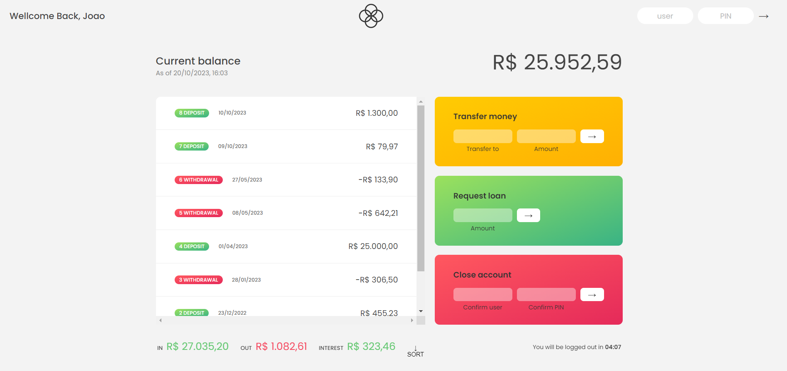

# Projetos em Destaque

Este repositório contém dois projetos incríveis, cada um destacando diferentes recursos e funcionalidades web. Abaixo, você encontrará uma breve visão geral de cada projeto, juntamente com instruções sobre como explorá-los e contribuir, se desejar.

## Projeto 1: [bankistWebPage]

![Projeto 1]

O primeiro projeto é uma demonstração de recursos e funcionalidades avançadas em desenvolvimento web. Ele utiliza JavaScript, HTML e CSS para criar uma experiência interativa. Alguns dos principais recursos incluem:

- **Modal Window**: Uma janela modal que pode ser aberta e fechada.
- **Navegação Suave**: Rolagem suave para seções diferentes da página.
- **Delegação de Eventos**: Implementação eficiente de eventos de clique.
- **Mensagem de Cookies**: Notificação de cookies e opção para fechá-la.
- **Navegação Sticky**: Barra de navegação que se fixa à medida que você rola a página.
- **Abas de Conteúdo**: Alternância entre diferentes abas de conteúdo.
- **Animação de Menu**: Animações ao passar o mouse sobre itens do menu.
- **Carrossel de Imagens**: Navegação entre imagens em um carrossel.
- **Lazy Loading de Imagens**: Carrega imagens somente quando visíveis.

## Projeto 2: [bankistApp]

![Projeto 2]

O segundo projeto também é uma criação impressionante e utiliza tecnologias web modernas. Ele apresenta recursos específicos que o diferenciam:

## Funcionalidades

- Login e autenticação de usuário.
- Visualização de movimentações de conta.
- Cálculo de saldo de conta.
- Exibição de resumo de movimentações (entradas, saídas e juros).
- Transferência de fundos entre contas.
- Solicitação de empréstimo ao banco.
- Fechamento de conta bancária.

## Como Usar

1. Clone o repositório para o seu computador:

2. Abra o arquivo index.html em seu navegador da web para iniciar o aplicativo.

3. Use as credenciais de login fornecidas no código para acessar a conta de teste.
   user1: jg , PIN: 1111
   user2: mf, PIN: 2222

4. Explore as funcionalidades do Bankist App.

### Projetos desenvolvidos durante curso de aprendizagem de JavaScript, desenvolvido juntamente com o mentor!
