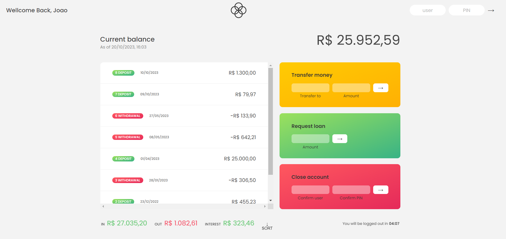

# Bankist App

O Bankist App é um aplicativo bancário fictício desenvolvido juntamente com o tutor como parte de um projeto de curso JavaScript.

## Visão Geral

O Bankist App é um aplicativo de gerenciamento de contas bancárias com as seguintes funcionalidades:

- Autenticação de usuários através de um username e PIN.
- Visualização de movimentos de conta, incluindo depósitos e saques.
- Cálculo de saldo da conta e resumo de movimentos.
- Transferência de dinheiro entre contas.
- Solicitação de empréstimo ao banco.
- Fechamento de contas de usuário.

## Tecnologias Utilizadas

- JavaScript
- HTML
- CSS

## Funcionalidades

- Login e autenticação de usuário.
- Visualização de movimentações de conta.
- Cálculo de saldo de conta.
- Exibição de resumo de movimentações (entradas, saídas e juros).
- Transferência de fundos entre contas.
- Solicitação de empréstimo ao banco.
- Fechamento de conta bancária.

## Como Usar

1. Clone o repositório para o seu computador:

2. Abra o arquivo index.html em seu navegador da web para iniciar o aplicativo.

3. Use as credenciais de login fornecidas no código para acessar a conta de teste.
   user1: jg , PIN: 1111
   user2: mf, PIN: 2222

4. Explore as funcionalidades do Bankist App.

## Aviso: Este é um projeto fictício desenvolvido para fins de aprendizado. Não se destina a ser usado em um ambiente de produção real.
