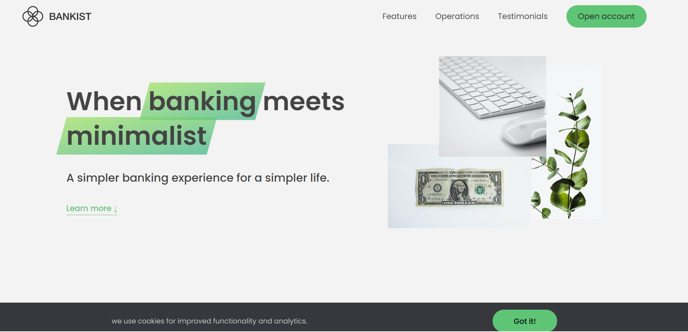

# Página da Web com Recursos Avançados

Esta é uma página da web que demonstra uma variedade de recursos e funcionalidades avançadas implementadas com JavaScript, HTML e CSS.

## Recursos Destacados

### 1. Modal Window

- Abre uma janela modal com um clique no botão "Open Modal".
- Fecha a janela modal ao clicar no botão "Close" ou pressionando a tecla "Esc".
- Usa transições suaves para exibir e ocultar a janela modal.

### 2. Navegação Suave

- Permite navegar suavemente para as seções da página com um clique nos links de navegação.
- Usa animações para rolar a página para a seção desejada.

### 3. Delegação de Eventos

- Usa o conceito de delegação de eventos para lidar com cliques nos links de navegação, otimizando o desempenho.
- Garante que os eventos de clique nos elementos filho sejam capturados pelo elemento pai.

### 4. Mensagem de Cookies

- Exibe uma mensagem de notificação de cookies no topo da página.
- Permite que os usuários fechem a mensagem ao clicar no botão "Got it!".

### 5. Navegação Sticky

- Implementa uma barra de navegação fixa que fica visível à medida que o usuário rola a página para baixo.
- Utiliza a Intersection Observer API para tornar a navegação sticky.

### 6. Abas de Conteúdo

- Permite alternar entre diferentes abas de conteúdo, exibindo informações relacionadas.
- Usa animações para destacar a aba selecionada e mostrar o conteúdo correspondente.

### 7. Animação de Menu

- Adiciona uma animação de fade ao passar o mouse sobre os itens do menu de navegação.
- Torna o logotipo opaco e ajusta a opacidade dos itens do menu.

### 8. Carrossel de Imagens

- Implementa um carrossel de imagens que permite navegar entre diferentes slides.
- Inclui botões de navegação e indicadores de slide.

### 9. Lazy Loading de Imagens

- Carrega imagens somente quando estão visíveis na janela do navegador.
- Melhora o desempenho da página, reduzindo o tempo de carregamento inicial.

## Como Usar

1. Clone o repositório para o seu computador:

2. Abra o arquivo index.html em seu navegador da web para visualizar a página da web e explorar as funcionalidades destacadas.

3. Certifique-se de explorar e testar cada recurso mencionado acima para entender melhor como eles funcionam.

## Observação: Este projeto é uma demonstração de recursos avançados de JavaScript, HTML e CSS e não deve ser usado em um ambiente de produção real. É destinado apenas para fins de aprendizado e demonstração.
